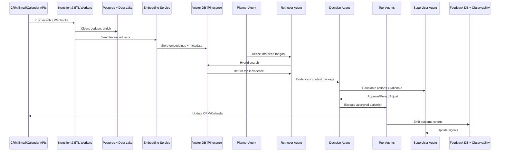
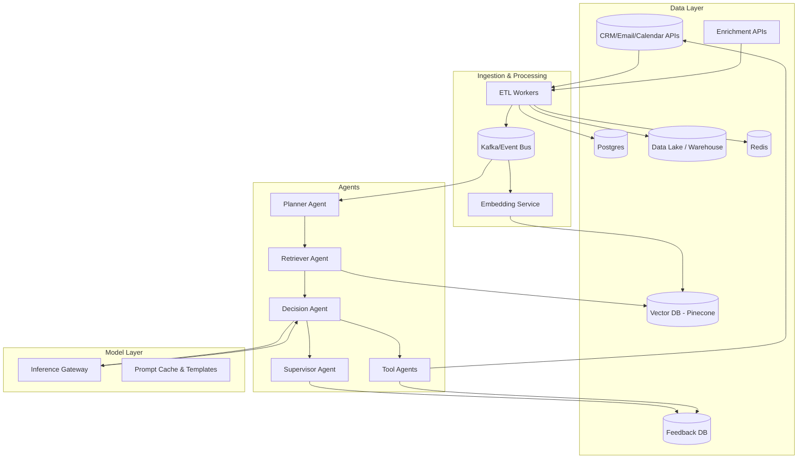

# Agentic GTM Platform – System Design

This document outlines the system design for an AI-native Agentic GTM Platform that combines:

- Retrieval-Augmented Generation (RAG) for knowledge retrieval  
- Multi-agent orchestration for decision making and execution  
- GTM data sources (CRMs, enrichment APIs, communication tools)  
- Observability & feedback loops for evaluation and continuous improvement  

---

## 1. High-Level Architecture

- Data Layer  
  - CRM / Email / Calendar integrations  
  - Enrichment APIs  
  - Postgres (OLTP) for workflow/session state  
  - Data Lake / Warehouse for analytics + historical signals  
  - Redis for cache (session context, embedding cache, hot retrieval)  
  - Vector DB (Pinecone) for ANN queries and metadata filtering  
  - Feedback DB for implicit/explicit signals  

- Ingestion & Processing Layer  
  - Kafka/Event Bus for real-time events  
  - ETL workers for canonical schema, dedupe, timestamp normalization  
  - Enrichment workers for external APIs  
  - Embedding Service for textual artifacts  

- Agentic Layer  
  - Planner Agent → Goal decomposition  
  - Retriever Agent → RAG + evidence fusion  
  - Decision Agent → LLM-driven action proposals  
  - Tool Agents → Execute via Email, Calendar, Enrichment APIs  
  - Supervisor Agent → Policy enforcement, safety, confidence scoring  

- Model Layer  
  - Model inference gateway (route to OpenAI, Anthropic, or self-hosted LLMs)  
  - Prompt templating & cache  
  - Microservices for few-shot/chain-of-thought patterns  

- Feedback & Learning  
  - Explicit feedback (approve/reject, edits, annotations)  
  - Implicit signals (open rates, deal progression)  
  - Airflow pipelines for retraining rerankers & adapters  

---

## 2. Sequence Diagram



---

## 3. Component Diagram



---

## 4. Prompt Templates

### Retriever Agent

```text
System: You are a Retriever Agent. Given a goal and context, build a hybrid query combining keywords and embeddings. 
Apply metadata filters: {tenant_id}, {recency_window}, {entity_type}. Return top-k evidence with relevance scores.

User Query: "{goal_description}"
```

### Decision Agent

```text
System: You are a Decision Agent. Given context (goal + evidence), propose the best next actions. 
Use structured reasoning, include rationale and confidence score. Reference evidence IDs explicitly.

Input: {goal_description}, {evidence_list}
```

### Supervisor Policy Rules

```text
- Reject actions with confidence < 0.6 unless explicitly approved by human.
- Reject outreach to unverified emails or stale contacts (>180 days).
- Escalate hallucinated entities for review.
- Enforce rate limits (3 emails/day/contact).
- If conflicting actions, trigger weighted voting or human approval.
```

---

## 5. Vendor Evaluation Checklist

### Pinecone / Vector DB

* Metadata filtering + hybrid search support
* Latency SLAs & multi-tenant isolation
* Cost structure (storage vs queries)
* Backup & recovery options

### LLM Providers

* Deployment options (SaaS, VPC, on-prem)
* Latency SLAs and throughput
* Data sensitivity guarantees (no training on customer data)
* Model variety (small, medium, large)

### Temporal / Workflow Orchestration

* Durable workflows & exactly-once semantics
* SDK support (Python, Go, Java)
* Scaling of workers & queues
* Retry/backoff mechanisms
* Deployment options & pricing

---

## 6. Scalability & Reliability Principles

* Horizontal scaling via Kubernetes + HPA
* Temporal for durable, exactly-once workflow execution
* Redis caching for embeddings & sessions
* Multi-region replication for critical tenants
* Fallback strategies when external services fail

---

## 7. Feedback Loops

* Explicit: Approve/reject decisions, edits, annotations
* Implicit: Email opens, replies, meeting acceptance, deal stage changes
* Learning:

  * Train reranker for retrieval
  * Fine-tune adapters for domain-specific decisioning
  * Classifiers for intent prediction

---

## Project Name

agentic-gtm-platform